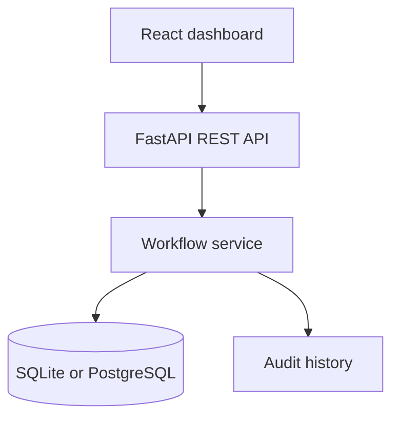

# Operations Workflow Hub

A role-aware internal operations dashboard for replacing spreadsheet-driven workflows with searchable work queues, reporting, and auditable status changes.

## Business problem

Operations teams often coordinate requests across email, chat, and spreadsheets. Ownership becomes unclear, reporting is manual, and changes are difficult to audit. This project demonstrates how a small internal tool can centralize that work without requiring a risky full-system rewrite.

## Capabilities

- Searchable and filterable work-item queue
- Priority, owner, status, and due-date tracking
- Role-aware API foundation
- Audit trail for workflow changes
- Operational summary metrics
- FastAPI OpenAPI documentation
- React dashboard with responsive cards and tables
- SQLite local development with a clean path to PostgreSQL
- Backend tests and containerized setup

## Architecture



## Quick start

> Important: use Python 3.11 for this project. Python 3.14 is currently too new for the pinned `pydantic-core` dependency and will fail during installation.

### API

```powershell
cd backend
py -3.11 -m venv .venv
.\.venv\Scripts\Activate.ps1
python -m pip install --upgrade pip
pip install -r requirements.txt
python -m uvicorn app.main:app --reload
```

On macOS/Linux:

```bash
cd backend
python3.11 -m venv .venv
source .venv/bin/activate
python -m pip install --upgrade pip
pip install -r requirements.txt
python -m uvicorn app.main:app --reload
```

API docs: [http://localhost:8000/docs](http://localhost:8000/docs)

### Dashboard

```bash
cd frontend
npm install
npm run dev
```

Dashboard: [http://localhost:5173](http://localhost:5173)

## Test

```bash
cd backend
pytest
```

## API endpoints

| Method | Endpoint | Purpose |
|---|---|---|
| GET | `/health` | Service health |
| GET | `/api/work-items` | Filter work queue |
| POST | `/api/work-items` | Create work item |
| PATCH | `/api/work-items/{id}` | Update workflow state |
| GET | `/api/metrics` | Dashboard totals |
| GET | `/api/audit-events` | Review change history |

## Security direction

The demo uses a development identity header to keep local setup simple. A production deployment should validate OIDC/JWT tokens, enforce roles server-side, store secrets outside Git, restrict CORS, and use managed PostgreSQL with encrypted backups.

## Roadmap

- CSV import with validation and preview
- OAuth/OIDC authentication
- Role management
- PostgreSQL and migrations
- Webhook/API connectors
- Saved reports and export
- End-to-end browser tests

## License

MIT
